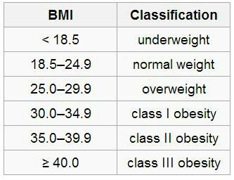

# 404B Lesson 3 Class Exercise - If/Elif/Else

## Instructions

### Split VS Code Window

You can drag `main.py` tab to the right side of the window to split the window into two panes. This will allow you to see the instructions and the code at the same time.

### Answering

You can answer the questions by writing your answers in the `main.py` file.

You can run the code by clicking the `Run` button on the top right corner of the editor.

The output will be shown in the `Terminal` tab at the bottom of the editor.

## if/elif/else Examples

### Sample

```python
if age < 13:
   print('Ticket price: $50')
elif age > 65:
   print('Ticket price: $20')
else:
   print('Ticket price: $100')
```

## if/elif/else Flow Diagram


## Questions

1. Write a program that interprets the Body Mass Index (BMI) based on a user's weight and height.

    It should tell them the interpretation of their BMI based on the BMI value.

    The BMI is calculated by dividing a person's weight (in kg) by the square of their height (in m).

    `BMI = weight / (height * height)`

    Sample input:

    ```
    weight = 70 ↩
    height = 1.7 ↩
    ```

    Sample output:

        70 x (1.7 x 1.7) = 24.221453287197235
        Your BMI is 24.221453287197235, you have a normal weight.

    All interpretations:

    - "Your BMI is 18, you are underweight."
    - "Your BMI is 22, you have a normal weight."
    - "Your BMI is 28, you are overweight."
    - "Your BMI is 32, you are in obesity class I."
    - "Your BMI is 36, you are in obesity class II."
    - "Your BMI is 42, you are in obesity class III."

    

1. Build an automatic pizza order program. Based on a user's order, work out the final bill.

   - Small Pizza: $45
   - Medium Pizza: $50
   - Large Pizza: $55

   - Pepperoni for Small Pizza: +$5
   - Pepperoni for Medium or Large Pizza: +$8
   - Extra cheese for any size pizza: + $3

   Sample input:

   ```
   Size (S, M, L): L ↩
   Add pepperoni (Y/N): Y ↩
   Extra cheese (Y/N): Y ↩
   ```

   Sample output:

   ```
   Your final bill is $66.
   ```

## Submitting Your Work

1. Make sure the assignment repository is opened in VS Code.

2. Make sure you have completed all the tasks.

3. (First time only)
Use Command + J to open the Terminal tab and config your git username and email:

    ```bash
    git config user.name "Your Name"
    git config user.email "Your GitHub Email"
    ```

4. Click on the "Source Control" icon on the left. Source Control

    

5. Enter a commit message and click on the "Commit" button.

Click on the "Sync Changes" button.
